# debian-solution-for-dualboot-with-amd-RX-5700-XT

language: pt-BR

## O Problema

Ao instalar o Debian em dualboot com o Windows 11, sendo que o Windows 11 estava instalado primeiro, após isso foi instalado o Debian.

Os dois sistemas operacionais no mesmo HD (SSD m.2).

Neste PC temos o Windows e Debian no SSD m.2 e um HD SATA 1TB para armazenamento de arquivos.

Na instalação do Debian optou-se por: particionamento assistido, usando o maior espaço livre. Esta decisão foi tomada considerando que dentro do Windows já liberamos 125 Gb para o Debian com o assistente de particionamento de disco.

Usou-se netinstall.

Depois de instalado o Debian, reiniciou o PC como de costume após a instalação e retirou-se o pendrive bootável.

Apareceu a tela do grub, escolheu-se o Debian, depois apareceu o seguinte erro:

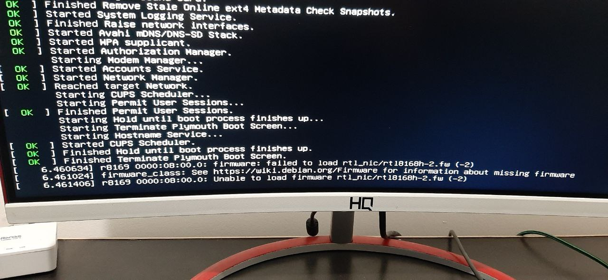

Após isso, apertou-se o botão de reiniciar no PC.

Não apareceu o grub. Reiniciou-se o PC novamente e entrou na UEFI BIOS.

Verificou-se que ela não estava mais reconhecendo o SSD m.2.

Pesquisando vi que as placas mãe ASUS tem vários relatos de problemas de que não consegue reconhecer os HD, em especial m.2. Porém, o mais estranho é que ele estava funcionando perfeitamente antes, então fiquei confuso e sem conseguir entender.

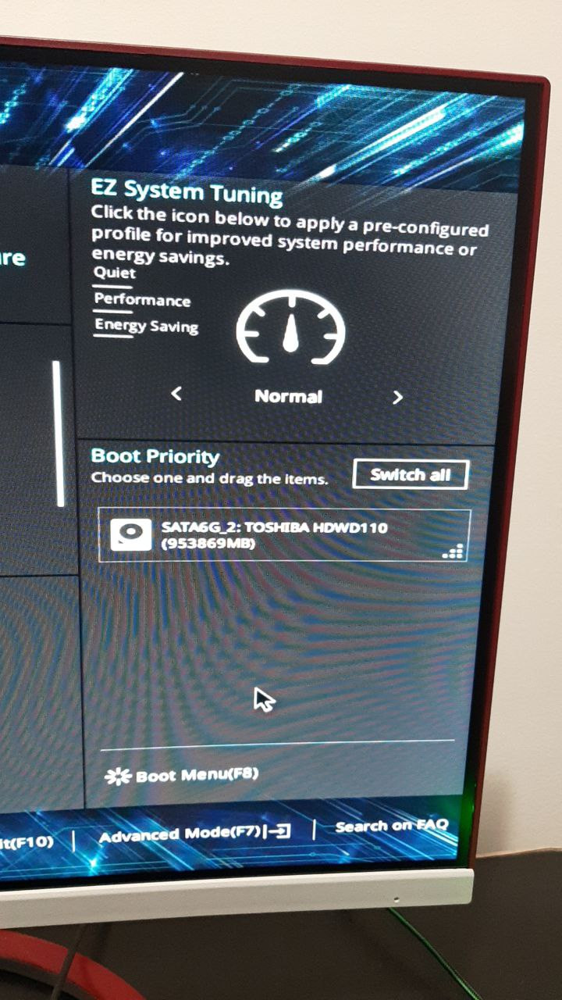

Neste momento pedi ajuda no grupo do Curso GNU/Linux do professor Kretcheu.

O professor Kretcheu respondeu de pronto no grupo, que eu estava omitindo detalhes do que fiz. Porém, sim, posso ter passado por algo que não observei, mas eu não soube quais detalhes acrescentar.

Então fiquei num ponto onde não entrávamos mais no grub e a placa mãe não reconhecia mais o m.2.

## Solução

Para conseguir que a placa mãe recenhecesse o m.2 novamente, retirei o HD SATA do slot 2 e coloquei no slot 3. Por mais estranho que isso possa parecer, a placa mãe voltou a reconhecer o SSD m.2 e o grub voltou. Placa mãe da ASUS.

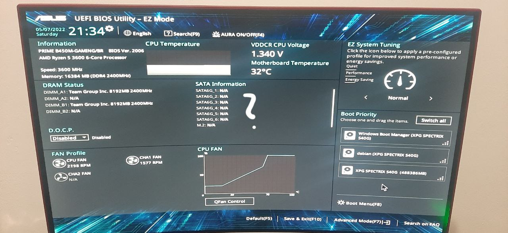

No grub agora, escolhi Debian e voltou para uma tela com um erro.

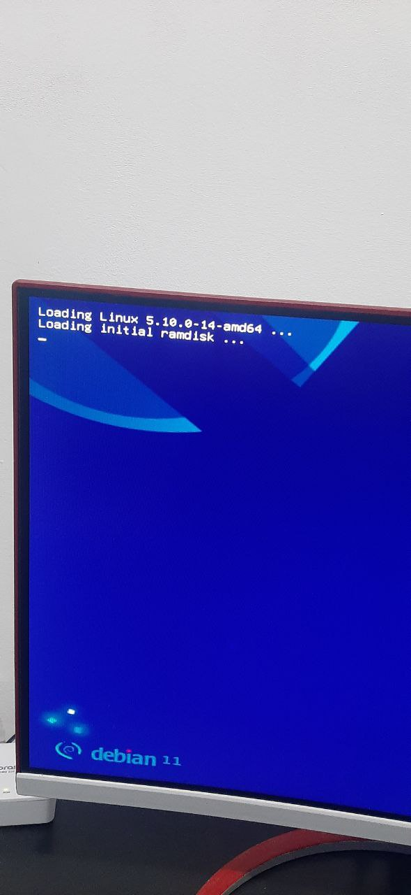

Neste momento enviei no grupo do Telegram do Curso GNU/Linux do professor Kretcheu este resultado, explicando que era onde consegui chegar.

Importante destacar que toda a solução que vem pela frente fizemos por meio da conversa no grupo do Telegram. E fica aqui minha admiração pela paciência e disponibilidade do professor Kretcheu.

O professor Kretcheu falou que o que ocorre é que o ambiente gráfico precisa de um firmware não livre, por isso não funcionou.

A partir de agora, vou colocando as ordens do professor e os resultados até chegarmos na solução.

Na tela do GRUB, tecla c, para acessar o console do GRUB. Daí digita:

```
 ls
```

Quando o instalador copia o bootloader prepara para o cenário corrente, se vc muda pode não ter o que precisa.

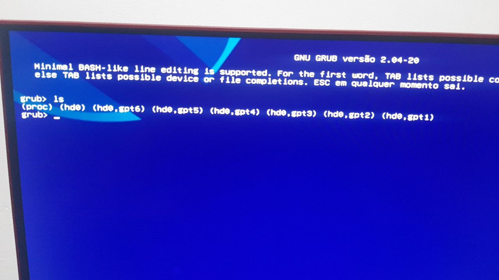

Lista cada uma das partições.

```
ls (hd0,gpt6)/
```

E também para as demais.

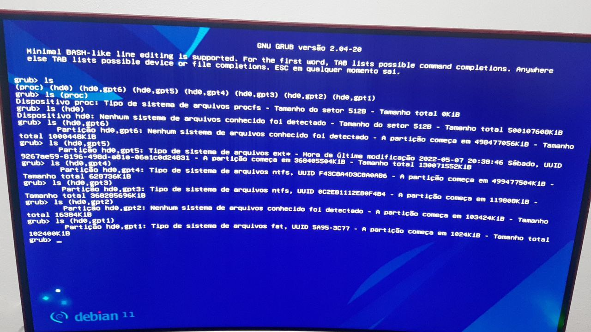

Faltou / no final, mas pelo que aparece aí, não fez uma instalação convencional.

Roda:

```
ls (hd0,gpt5)/boot
```

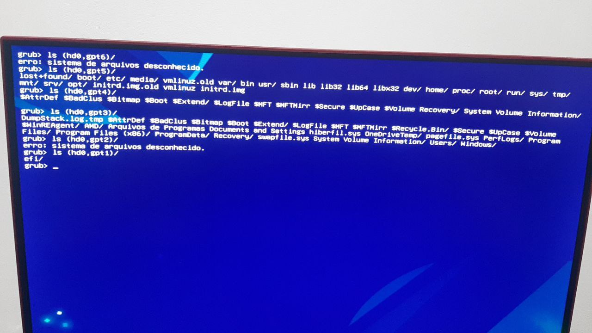


Aparentemente tudo em ordem.

```
ls (hd0,gpt5)/boot/grub
```


Tem até o grub.cfg. 

```
configfile (hd0,gpt5)/boot/grub/grub.cfg
```

Professor Kretcheu explicou que se não conseguiu carregar initram e kernel, tem coisa errada.

Neste momento me precipitei e reiniciei novamente o PC pensando que agora daria certo, mas eu deveria ter esperado.

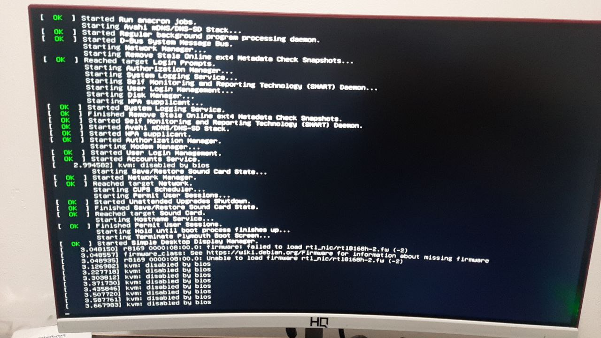

Daí o professor me pediu calma, que ele ia dar uns comandos para gente ter um terminal.

Então, na tela do GRUB tecla "e"

Para editar, na linha linux, troca quiet por single.

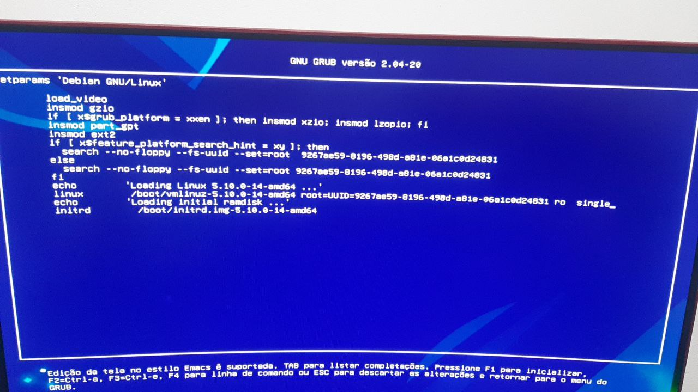

Depois dei um Ctrl X para executar.


Manda uns ENTER aí.

Entra com root.

Ok, agora precisa ver logs, veja se tem rede.

```
ip -c a
```

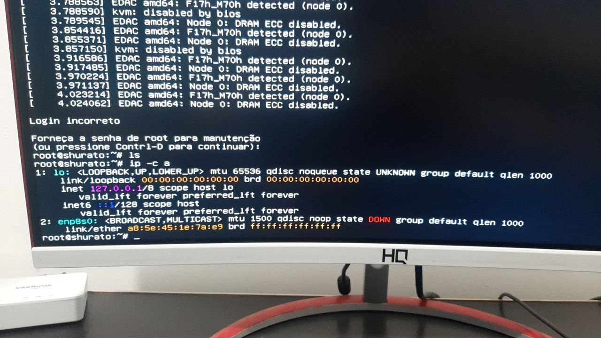

Tem cabo de rede? Sim.

```
ip link set dev enp8s0 up

dhclient enp8s0

ip -c a
```

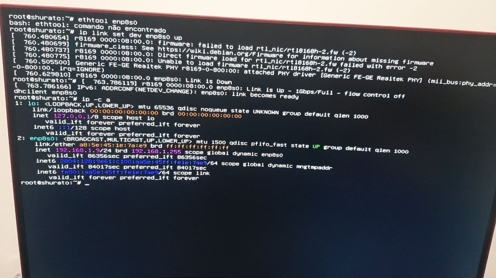

Massa, agora tem rede, dá para conseguir instalar o que seja necessário.

Roda:

```
lspci -nnkd::0300
```

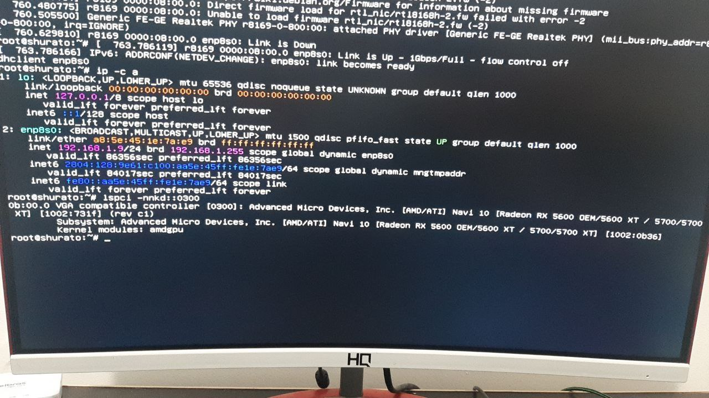

Ao que vi essa placa precisa de um firmware não-livre. Roda:

```
apt policy
```

Para ver os repositórios configurados.

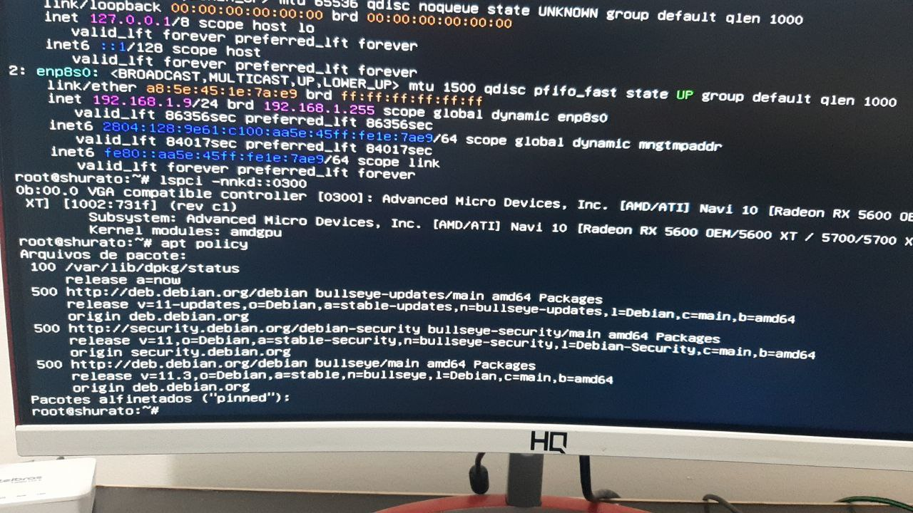

Vc precisa editar os repositórios para incluir o non-free, caso queira. Eu tenho um arquivo preparado.

```
wget -O /etc/apt/sources.list kretcheu.com.br/sources.list.non-free
```

```
apt policy
```

Para conferir se ficou ok.

Daí:

```
apt update
```

```
apt install firmware-amd-graphics
```


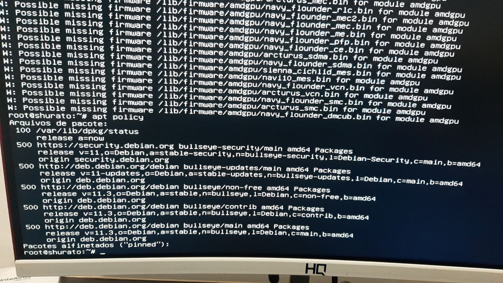

veja se tem xserver-xorg-video-amdgpu

```
dpkg -l xserver-xorg-video-amdgpu
```

Tem.

Veja o que rola:

```
systemctl isolate graphical.target
```

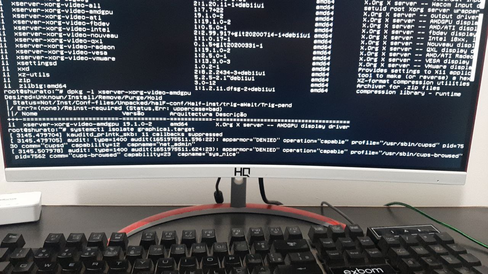

Acho que vale uma tentativa do zero, agora que já instalou o firmware. Manda um reboot! hehe.


SENSACIONAL.

Estou rindo aqui.. felicidade. só tenho a te agradecer imensamente, professor!!! Não tenho palavras.
Sábado. A noite, quase meia noite. E o senhor me ajudando. Foi muito rica essa experiência. 
Pra uns pode parecer coisa boba mas pra mim foi incrível.
@kretcheu você é o cara!!!